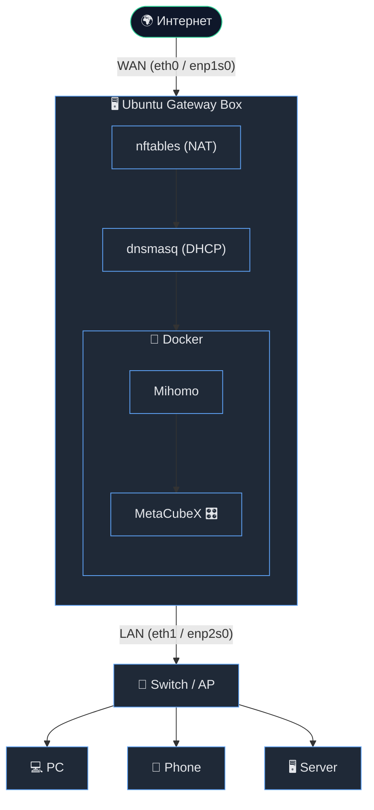

# 🌐 Ubuntu Gateway + Mihomo

Интерактивный установщик шлюза на **Ubuntu/Debian**, превращающий мини-ПК с двумя сетевыми портами в полноценный gateway с **Mihomo** ⚡

---

## 🗺 Схема работы



---

## 🚀 Быстрый старт

```bash
curl -fsSL -o install-gateway-docker.sh https://raw.githubusercontent.com/quick-1y/mihomo-gateway/main/install-gateway-docker.sh
chmod +x install-gateway-docker.sh
sudo ./install-gateway-docker.sh
```

Всё остальное — интерактивно 🎛

---

## 📁 Структура проекта

```text
mihomo-gateway/
├── install-gateway-docker.sh
└── mihomo/
    └── config.yaml
```

---

## 🛠 Что делает установщик

- 🔌 Определяет **WAN/LAN** интерфейсы
- ⚙️ Настраивает **Netplan**, **dnsmasq**, forwarding и **nftables**
- 🐳 Ставит **Docker**
- ▶️ Запускает и управляет **Mihomo** + **MetaCubeXD**
- 📊 Даёт меню: диагностика, настройки, удаление, восстановление сети

---

## 📦 Файлы конфигурации

- `mihomo/config.yaml` — шаблон конфига Mihomo

---

## 📄 Лицензия

См. [LICENSE](LICENSE)
